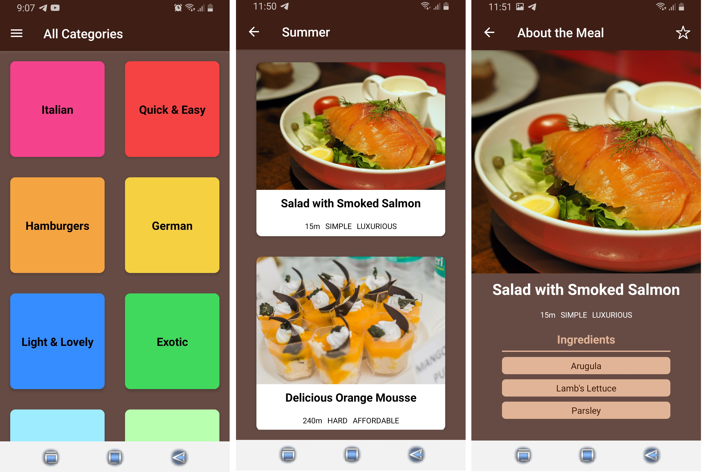

# Gourmand

Cooking recipies application built with React Native.

### Features of App

- User can browse around meals and dive into the details of every meal
- User can favorite or unfavorite different meals.
- User can view all the favorites on the favorites screen.

### Tech Stack

- React Native
- Expo
- React Navigation package (Drawer Navigator, Tabs Navigator)
- Redux
- Context API

### Pages

Main screen | Meals category screen | Meal's details screen

---

Feel free to install and play with this project.

Link to install app for Android devices -
<a href='https://expo.dev/accounts/olekpavlyk/projects/gourmand/builds/b21ef86d-7ba9-4d8f-9a2f-d402a00e3e05'>Download 'Gourmand App'</a>
